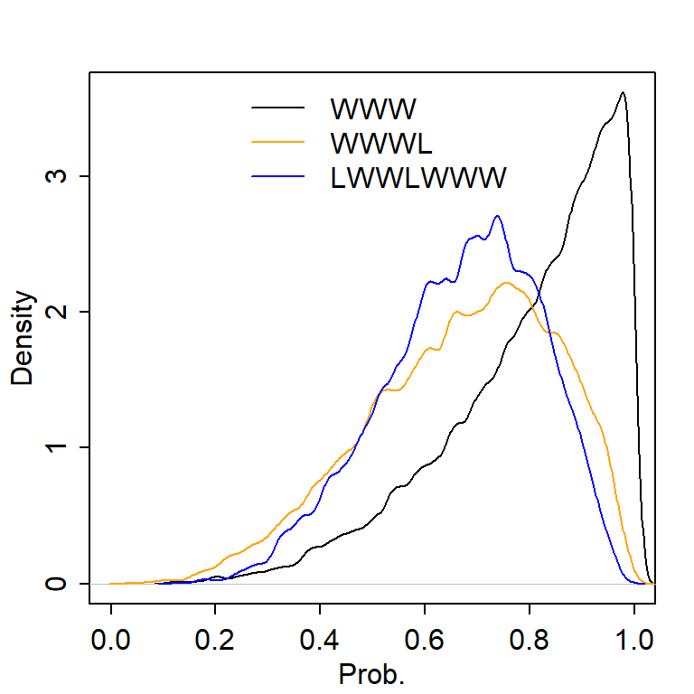
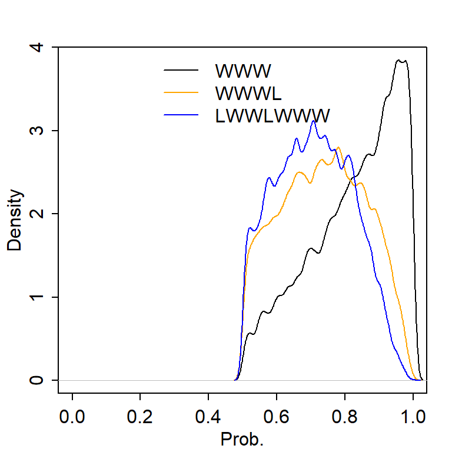

**2E1.** (4) <br>
**2E2.** (3) <br>
**2E3.** (1) <br>
**2E4.** When we toss the globe, 70% of the time we will have water. <br>
**2M1.** 


```r
gridapprox_fun <- function(w, toss) {
  grid_size = 1000
  grid_p = seq(0, 1, length.out = grid_size)
  prior = rep(1, grid_size) ## uniform prior
  likelihood = dbinom(w, toss, grid_p)
  posterior_unstd = likelihood * prior
  posterior = posterior_unstd/sum(posterior_unstd)
  samples = sample(grid_p, size = 1e4,  replace = T, prob=posterior)
}

w3 <- gridapprox_fun(w = 3, toss = 3)
w3l1 <- gridapprox_fun(w = 3, toss = 4)
w5l2 <- gridapprox_fun(w = 5, toss = 7)
```

```r
dens(w3, xlab = "Prob.", xlim = c(0, 1))
dens(w3l1, add = T, col = "orange")
dens(w5l2, add = T, col = "blue")
legend("top", col=c("black", "orange", "blue"), bty = "n", lty = 1,
       legend = c("WWW", "WWWL", "LWWLWWW"))
```

<!-- -->

**2M2.** 


```r
gridapprox_fun2 <- function(w, toss) {
  grid_size = 1000
  grid_p = seq(0, 1, length.out = grid_size)
  ## zero when p<0.5 and uniform when p>=0.5
  prior = c(rep(0, sum(grid_p<0.5)), rep(1, sum(grid_p>=0.5))) 
  likelihood = dbinom(w, toss, grid_p)
  posterior_unstd = likelihood * prior
  posterior = posterior_unstd/sum(posterior_unstd)
  samples = sample(grid_p, size = 1e4,  replace = T, prob=posterior)
}
w3 <- gridapprox_fun2(w = 3, toss = 3)
w3l1 <- gridapprox_fun2(w = 3, toss = 4)
w5l2 <- gridapprox_fun2(w = 5, toss = 7)
```

```r
dens(w3, xlab = "Prob.", xlim = c(0, 1))
dens(w3l1, add = T, col = "orange")
dens(w5l2, add = T, col = "blue")
legend("top", col=c("black", "orange", "blue"), bty = "n", lty = 1,
       legend = c("WWW", "WWWL", "LWWLWWW"))
```

<!-- -->

**2M3.** $$P(E|L)=\dfrac{P(L|E)P(E)}{P(L|E)P(E) + P(L|M)P(M)} =
\dfrac{0.3 \times 0.5}{0.3 \times 0.5 + 1 \times 0.5}=0.23$$ <br>

**2M4.** The BB card has two ways to have a black side facing up, the BW 
card has one way to have a black side facing up, and the WW card has 0 way
to have a black side facing up. Thus, 2/(2+1+0)=2/3. <br>
**2M5.** Both BB cards have two ways to have a black side facing up, the BW 
card has one way to have a black side facing up, and the WW card has 0 way
to have a black side facing up. Thus, (2+2)/(2+2+1+0)=4/5. <br>
**2M6.** 


```r
ways_b <- c(2, 1, 0)
ways_pull <- c(1, 2, 3)
(prob_b <- ways_b[1]*ways_pull[1]/sum(ways_pull*ways_b)) 
```

```
## [1] 0.5
```

**2M7.** The below vector represent BB, BW, and WW.


```r
ways_1b <- c(2, 1, 0)
ways_2wgiven1b <- c(3, 2, 1)
(prob_b <- ways_1b[1]*ways_2wgiven1b[1]/sum(ways_1b*ways_2wgiven1b))
```

```
## [1] 0.75
```

**2H1.** $$P(A|\text{twin})=\dfrac{P(\text{twin}|A)P(A)}{P(twin|A)P(A) + 
P(\text{twin}|B)P(B)} = \dfrac{0.1 \times 0.5}
{0.1 \times 0.5 + 0.2 \times 0.5} = 1/3$$ 
$$
P(B|\text{twin}) = 1-P(A|\text{twin}) = 2/3
$$ 
$$P(\text{another twin}) = P(\text{another twin}|A, twin) \times P(A|twin) + 
P(\text{another twin}|B, \text{twin}) \times P(B|\text{twin})
= 0.1 \times 1/3 + 0.2 \times 2/3 = 1/6$$ 
**2H2.** See 2H1. $P(A|\text{twin})=1/3$.  <br>
**2H3.** $$P(A|T, S) = \dfrac{P(T, S|A)P(A)}{P(T, S|A)P(A) + P(T, S|B)P(B)}
= \dfrac{0.1 \times 0.9 * 0.5}{0.1 \times 0.9 \times 0.5 + 0.2 \times 0.8
\times 0.5} = 0.36$$
**2H4.** Without using birth data, 
$$P(A| test A) = \dfrac{P(test A|A) P(A)}
{P(test A|A)P(A) + P(test A|B)P(B)} =
\dfrac{0.8 \times 0.5}{0.8 \times 0.5 +(1-0.65) \times 0.5} =0.70$ 


```r
round(0.8/(0.8+0.35), 2)
```

```
## [1] 0.7
```

Using the birth data, we have $P(A|T, S) = 0.36$$ <br>
$$P(A|testA, T, S) = \dfrac{P(test A|A) P(A|T, S)}
{P(test A|A) P(A|T, S) + P(test A|B)P(B|T, S)} =
\dfrac{0.8 \times 0.36}{0.8 \times 0.36 +(1-0.65) \times (1-0.36)} =0.56$$ 


```r
round(0.8*0.36/(0.8*0.36+0.35*0.64), 2)
```

```
## [1] 0.56
```

